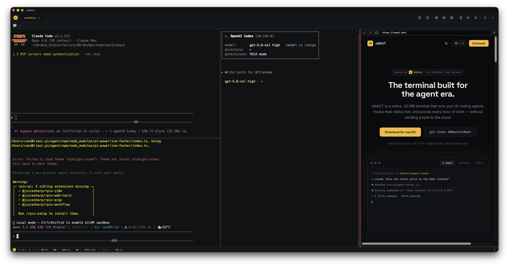
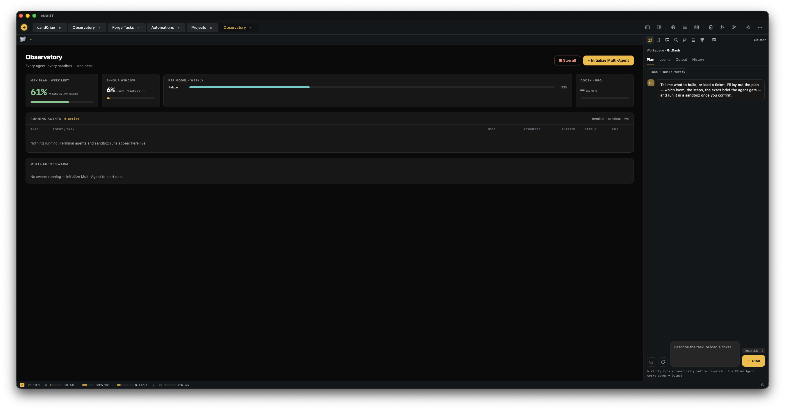

# xNAUT - AI-Powered Native Terminal

<div align="center">

```
  ██╗  ██╗███╗   ██╗ █████╗ ██╗   ██╗████████╗
  ╚██╗██╔╝████╗  ██║██╔══██╗██║   ██║╚══██╔══╝
   ╚███╔╝ ██╔██╗ ██║███████║██║   ██║   ██║
   ██╔██╗ ██║╚██╗██║██╔══██║██║   ██║   ██║
  ██╔╝ ██╗██║ ╚████║██║  ██║╚██████╔╝   ██║
  ╚═╝  ╚═╝╚═╝  ╚═══╝╚═╝  ╚═╝ ╚═════╝    ╚═╝
```

**A native terminal for working with a fleet of coding agents.**

[](https://github.com/48Nauts-Operator/xNaut/releases)
[](https://www.rust-lang.org/)
[](https://tauri.app/)
[](LICENSE)

[xnaut.dev](https://xnaut.dev) · [Download](https://github.com/48Nauts-Operator/xNaut/releases/latest)

<br/>



</div>

---

## Why xNAUT?

xNAUT is a native terminal and dev cockpit for running AI coding agents — with
**your own subscription**, not a per-seat markup. Built with Rust + Tauri v2,
it's a ~20MB native download and it actually feels fast.

Run any agent (Claude Code, Codex, Gemini, opencode…) in a terminal, split it
across parallel worktrees, or hand a task to the **NautLoom Cloud Agent** and
get a branch and a PR back. macOS & Windows.

---

## Features

### Terminal Core
- Multiple PTY sessions with tabs; split panes (up to 16 per tab)
- zsh / bash / fish auto-detection, full xterm.js (256-color + truecolor)
- Clickable URLs, shell integration (OSC 133) for prompt detection

### Project Workspaces
- Every tab belongs to a project — selecting a project card shows only its tabs,
  with a shared **Home** workspace for global views
- Open any folder as a project (right-click → "Open as project", or ask the
  agent); drag a file/folder onto a terminal to insert its path
- Right-pane root picker switches the file tree between Home, project root, and
  the current project

### AI Agents
- **Agent Library + AgentFather** — reusable agent profiles (personas, roles,
  skills, tools, access scopes, constraints, runtime model)
- **Agent Runner** — launch any coding CLI with a live status strip (working /
  done / blocked / waiting), hook-driven real-time state; click a pill to jump
  to its tab
- Provider-aware Agent Chat — switch agent + model independently across
  Anthropic, OpenAI, OpenRouter, LM Studio, and Ollama

### NautLoom Cloud Agent
- A self-hosted, portable coding agent: **Plan → sandbox → live stream → demo →
  code return → ship (branch + PR)**
- Runs in isolated GitVM microVM sandboxes and pulls the code back before teardown

### Observatory
- A command deck of every running agent (terminal + sandbox) — elapsed, model,
  status — with your plan's weekly budget on top and a PRs-to-review table

<div align="center"></div>

### Multi-Agent Swarm
- A manager chat that validates your open tickets against the project manager
  and dispatches parallel agent runs — one isolated git worktree per run, capped
  by a max-parallel setting

### Plan Mode
- Two-pane planning workspace from any PM project: chat (left) + a live
  `PLAN.md` (right), solution-architect persona, Edit/Preview toggle

### Diff Viewer with AI Annotations
- Side-by-side / unified `git diff HEAD` for any worktree, with inline note
  cards read from `<worktree>/.xnaut/notes.json`
- HTTP broker so external agents (Claude Code, Codex, …) can add/apply/list
  annotations

### Worktree Manager
- Create worktrees pre-wired for painless push (`--no-track` +
  `push.autoSetupRemote=true`) and launch any agent directly in the new tree

### Project Management & NautFlow *(optional)*
- A local Git-backed control repo for projects, tickets, and workflow events
  (Forgejo or GitHub) — Kanban + table views, ticket details, Vault-document links
- NautFlow: stage workspaces, versioned Markdown artifacts, agent collaboration,
  review + promotion

### Markdown Vault
- Wiki-linked `work` + `personal` vaults under `~/.xnaut-vault` — note tree,
  tags, search, backlinks, wikilinks, templates
- A Vault Librarian chat that searches, reads, creates, moves, and tags notes
  through deterministic tool actions

### More
- **Forge review workspace** — Forgejo/GitHub issues & PRs open inside xNAUT
  with agent-generated RCA
- **Browser & Markdown panes** — native webview / dependency-free Markdown
  (marked + highlight.js + Mermaid) beside your terminal
- **Settings** (`Cmd+,`), 50 bundled themes + AI theme generator, command
  snippets, file navigator + editor, SSH profiles, triggers, error monitor
- **Work Session Logger** — Merkle-proofed command log with HTML/PDF reports
  for billable hours
- **Privacy Monitor** — transparent LLM proxy that flags leaked keys /
  credentials / PII in prompts
- **Auto-update** — signed releases checked on startup, one-click update
- **Cross-platform** — macOS (Apple Silicon + Intel) and Windows (`.msi` / `.exe`)

---

## Supported Agents

xNAUT runs coding agents with **your own subscription** — no per-seat markup.
Launch any of these in a terminal, a worktree, or the Cloud Agent, and drive
them from the status strip and Agent Chat:

| Agent | |
|---|---|
| **Claude Code** | Anthropic's coding CLI |
| **Codex** | OpenAI's coding CLI |
| **Gemini** | Google's coding CLI |
| **Grok** | xAI's coding CLI |
| **opencode** | open-source agent |
| **Custom** | any CLI, via `~/.config/xnaut/agents.toml` (5 prompt-injection strategies cover each CLI's quirks) |

**LLM providers** for the built-in Agent Chat: Anthropic, OpenAI, OpenRouter,
plus local **LM Studio** and **Ollama** — configured in Settings → AI.

---

## Getting Started

### Install

Download the latest build from
[Releases](https://github.com/48Nauts-Operator/xNaut/releases/latest):

| Platform | File |
|---|---|
| macOS (Apple Silicon) | `xNAUT-<ver>-macos-aarch64.dmg` |
| macOS (Intel) | `xNAUT-<ver>-macos-x64.dmg` |
| Windows | `xNAUT-<ver>-windows-x64-setup.exe` or `.msi` |

The macOS DMGs are **Apple-notarized** — open the DMG and drag **xNAUT** to
Applications; it launches cleanly with no Gatekeeper warning. New versions are
offered in-app via the auto-updater.

### Build from source

**Prerequisites**

- **Rust 1.70+** — [rustup.rs](https://rustup.rs/)
- **macOS**: `xcode-select --install`
- **Linux**: `sudo apt install libwebkit2gtk-4.1-dev build-essential libssl-dev libgtk-3-dev`

```bash
git clone https://github.com/48Nauts-Operator/xNaut.git
cd xNaut/src-tauri

# Development (with hot reload)
cargo tauri dev

# Release build
cargo tauri build

# Launch
open target/release/bundle/macos/xNAUT.app
```

---

## Keyboard Shortcuts

| Shortcut | Action |
|----------|--------|
| `Cmd+,` | Settings |
| `Ctrl+T` | New tab |
| `Ctrl+W` | Close tab |
| `Opt+D` | Split vertical |
| `Shift+Opt+D` | Split horizontal |
| `Opt+Arrow` | Navigate panes |
| `Opt+W` | Close pane |
| `Ctrl+Shift+R` | Toggle Ralph panel |
| `Ctrl+R` | Command history |
| `Escape` | Close Settings / modals |

All shortcuts are rebindable in Settings > Keyboard Shortcuts.

---

## Architecture

```
Frontend (HTML/CSS/JS + xterm.js)
    |  Tauri IPC
Backend (Rust)
    ├── pty.rs          PTY sessions + directory tracking
    ├── worklog.rs      Session logging, Merkle proof, QR, reports
    ├── nautloom.rs     Cloud Agent runs, ship/PR, sandbox stats
    ├── sandbox.rs      GitVM microVM driver (create/exec/destroy)
    ├── ssh.rs          SSH connections
    ├── ai.rs           LLM provider integration
    ├── commands.rs     Tauri commands (file nav, editor, forge)
    ├── triggers.rs     Pattern matching & automation
    ├── state.rs        Thread-safe shared state
    └── main.rs         Native menu, updater, app setup
```

- **Binary size**: ~29MB (release, stripped); ~20MB DMG
- **Memory per terminal**: ~2MB
- **PTY creation**: <100ms
- **IPC latency**: Sub-millisecond

Deployment, code-signing, and notarization are documented in the
[knowledge base](https://github.com/48Nauts-Operator/xNaut) (xNaut → Deployment).

---

## CI/CD

xNAUT uses reusable GitHub Actions workflows from
[48Nauts-Operator/ci-workflows](https://github.com/48Nauts-Operator/ci-workflows):

- `cargo fmt --check` -- formatting
- `cargo clippy -D warnings` -- linting
- `cargo test` -- unit tests
- `cargo audit` -- security vulnerabilities

Releases are built and Apple-notarized by `.github/workflows/release.yml` on a
`v*` tag. Every PR must pass all checks before merge.

---

## Roadmap

- [ ] Module system -- loadable tool packs with community SDK
- [ ] Community Hub -- GitHub-based package registry for sharing scripts
- [ ] SecondBrain integration -- terminal long-term memory
- [ ] Privacy reports -- privacy-monitor data folded into work reports
- [ ] Linux support (AppImage, .deb)

---

## License

Released under the **MIT License** — © 2026 André Wolke, 48Nauts. See
[LICENSE](LICENSE) for the full text. Free and open source, free forever.

---

*Built with Rust, Tauri v2, and too much coffee.*
