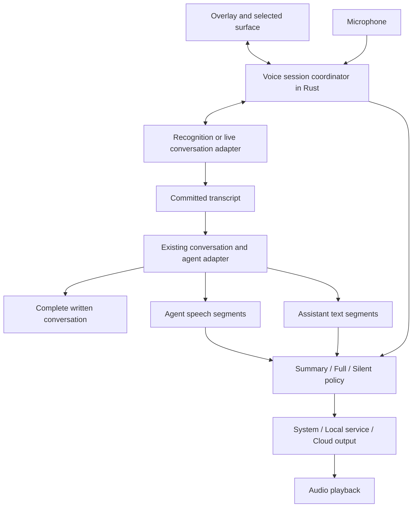

# Voice conversations in Xnaut

Status: target architecture; initial implementation underway. See [build progress](voice-build-progress.md) for what is actually implemented and measured.
Date: 2026-09-16.
Implementation sequence: [Voice implementation plan](voice-implementation-plan.md).

## Current release scope — 2026-09-28

User clarification: bring Bucki's working public continuous-conversation route into xNaut for **V1**, including transcripts saved with the conversation and resuming its context later. **V2** adds the private Jarvis route. This supersedes local-first delivery and the System-default assumption for V1 in the long-term provider table below. Public voice starts explicitly; opening a saved conversation must not activate the microphone automatically. The working Bucki experience is the reference; the current xNaut button-driven prototype is not acceptance evidence.

## Product decision

Add one voice overlay that connects to the selected Xnaut conversation or editable field. Voice processing and task execution are independent. A user can switch from paid cloud voice to system speech or a private local service without changing the selected execution agent or losing the written conversation.

The public application must not require a second language model, Python environment, GPU, or Bucky installation. It ships generic integrations and instructions. The owner's Jarvis voice recordings, trained assets, persona, memories, credentials, and machine configuration remain outside the public repository and release artifacts.

Three independent choices define a session:

| Choice | Values | Default |
| --- | --- | --- |
| Voice connection | System; Local service; Cloud | System, after capability detection; never automatically Cloud |
| Spoken output | Full; Summary; Silent | Summary when the agent supports it; otherwise an explicit unavailable state |
| Execution | Existing selected agent/model | Preserve the conversation's current selection |

Voice starts only from a user gesture. Remember preferences per project, with optional conversation overrides; do not resume microphone capture automatically after launch. Jarvis is a user-defined local profile name, not a bundled product dependency.

## Evidence from the existing implementations

| Existing component | Observed behavior | Consequence |
| --- | --- | --- |
| `src-tauri/src/voice.rs` | Native cpal capture; stop recording, then transcribe through whisper-cli; first-use model download | Preserve existing dictation. It is not a streaming recognition implementation. |
| `src/js/voice-dictate.js` | Shared microphone button for Chat and Agent Space | Add conversation voice alongside this entry point. |
| `src-tauri/src/chat.rs` | Plain completion path emits `chat://chunk`; `chat_send_tools` normally returns a complete tool-loop answer | Streaming support must cover the actual tool path, not just the fallback. |
| `src-tauri/src/agent_tools.rs` | Tool execution loop currently consumes complete JSON responses | Add a turn event sink and incremental parsing without executing partial tool arguments. |
| `src/js/agent-space.js`, `src-tauri/src/agents.rs` | Codex uses `exec --json`; parser publishes completed `agent_message` items | Retain a compatibility adapter; add App Server for incremental Codex output and steering. |
| `src-tauri/src/agent_hooks.rs` | Authenticated project MCP server shared by launched agents | Possible transport for session-scoped spoken-summary tools; current shared authorization is insufficient to identify the speaking turn. |
| `src-tauri/src/settings.rs` | Rust-owned durable settings, including preservation of unknown keys | Add versioned voice settings here. Migrate existing frontend Kokoro preferences explicitly. |
| Bucky `scripts/run-jarvis.sh` | Parakeet recognition, Qwen3-TTS, and a Qwen/MLX conversational model behind a loopback Realtime-compatible server | Reuse speech components through an adapter; do not make its conversational model a required second agent. |
| Bucky `OpenAIRealtimeRunner.swift` | Native audio, local/cloud routing, playback queues and interruption handling | Port behavior with attribution where appropriate; Swift code is not directly reusable in Tauri's cross-platform backend. |
| Bucky `GPTLiveSession.swift`, `CodexVoiceBackend.swift` | GPT-Live voice with a separate subscription-authenticated Codex backend | Voice and reasoning costs are already separable. |

The inspected speech runtime's `response.create` handler triggers LLM generation. It is not an existing arbitrary-text TTS endpoint. A speech-only local bridge is an explicit implementation dependency, not a configuration toggle we have already verified.

Code inspection confirms these mechanisms, not microphone quality, achieved latency, API entitlement, or release readiness. Bucky's older README does not describe its current native local speech configuration accurately enough to use as the implementation specification.

## Scope

First supported surfaces: Agent Space and the shared Chat pane. Extend through a surface registry to Plan, Vault, and other Xnaut composers. Plain fields support dictation and optional readback, without assuming there is an agent response stream.

Cross-application dictation and response capture are a later OS integration. An arbitrary terminal or external application's focused field does not expose reliable assistant messages. Do not scrape terminal redraws, tool logs, or screen text and treat them as assistant responses.

## Architecture



The coordinator owns microphone exclusivity, session identity, provider lifecycle, privacy checks, cancellation, and bounded playback queues. The frontend owns the overlay and surface selection. Audio normally stays in native/backend transports; send levels, state, transcripts, and playback receipts to the UI, not high-frequency base64 audio through global DOM events.

A browser/WebRTC media adapter may own media tracks if validated on supported Tauri webviews. Its control plane still obeys the coordinator. Choose one microphone owner per session; never start browser and native capture together. Native WebSocket transport is the initial local-service path, matching the existing cpal backend and Jarvis service design.

### Surface contract

A registered surface supplies a stable conversation/field ID and functions for inserting a committed transcript, submitting a turn, subscribing to normalized agent events, and optionally steering/cancelling work. It advertises its capabilities rather than assuming every field can submit or cancel.

Keep the destination pinned while the overlay is active. Clicking elsewhere does not redirect speech mid-utterance. The user explicitly selects another destination; Xnaut completes or discards the current draft before rebinding. Closing the destination ends its voice connection.

Two input behaviors are explicit: **Dictate** inserts text for review; **Converse** submits completed utterances through the existing send path. Converse is available only on conversation surfaces. Partial recognition updates are drafts and must not execute tasks.

### Agent event contract

Normalize integrations to these proposed internal events:

```text
turn.started
assistant.text.delta / assistant.text.completed
assistant.speech.segment { segmentId, kind: progress|answer|question, text }
tool.started / tool.completed
approval.required
turn.completed / turn.failed / turn.cancelled
```

Each event carries `conversationId`, `turnId`, `sequence`, and a source message ID where available. Voice delivery adds `sessionId`, `sessionEpoch`, and `playbackGeneration`. Identity is attached by trusted adapters, never inferred from model-written text.

Written conversation history remains authoritative. Store speech segments as optional presentation metadata, linked to the source turn. Do not inject a spoken summary as another user message or execute it as a task. Provider-specific spoken transcripts can be shown separately when they differ from the written answer.

## Agent-generated summaries

The selected execution model produces the short spoken version during its existing task. No additional summarization model or automatic follow-up summarization request is required.

Preferred mechanism: a narrowly scoped `voice_emit` function/tool available only to a voice-enabled turn. It accepts a short complete utterance, a segment ID, and a kind. Xnaut binds it to that turn and returns an immediate queued/dropped acknowledgement; synthesis and playback run independently. It cannot run commands, select providers, change privacy, or claim a tool action succeeded.

Example proposed payload:

```json
{
  "segmentId": "answer-1",
  "kind": "answer",
  "text": "The connection issue is fixed. Tests pass. One setting still needs your input."
}
```

Instructions ask for brief progress only when useful, then a result grounded in completed work, and the full written answer normally. A question that needs a user response is both visible and speakable. Do not request or broadcast internal reasoning. Default segment limit: 80 words and 1 KiB of UTF-8 text; adapter validates both, and rejects oversized payloads without truncating an important qualification.

Register the function directly in built-in tool chat. For Codex App Server, use a supported dynamic-tool route after validating the installed protocol. For other supported CLI agents, use authenticated MCP with a per-launch/turn binding. The current shared project MCP bearer must not let one agent speak into another conversation. Only expose the speech tool when that binding exists.

Tool use can introduce a model continuation and costs tokens; do not advertise zero latency or a universally single API request. Measure the overhead in the capability spike. A runtime with an independently supported structured presentation channel may emit the same normalized event without a tool round trip. Do not invent undocumented CLI channels or wrap arbitrary answers in required JSON that conflicts with existing action/plan formats.

If a provider cannot emit a reliable speech segment, show Summary as unsupported for that adapter. If a capable model omits it, preserve the answer and show “No spoken summary supplied” with a manual Read answer action. Do not secretly run a summarizer or read the full answer automatically. A ready final summary may wait until `turn.completed`; explicit progress/question segments may play earlier. This keeps incomplete results from being presented as final success.

## Output policy

| Mode | Source and timing | Rules |
| --- | --- | --- |
| Full | Validated assistant answer text, queued in complete sentences as available | Preserve wording; remove visual Markdown syntax. Code, URLs, tables, and logs have explicit read options. Do not speak scaffolding/action JSON or raw tool arguments. |
| Summary | `assistant.speech.segment` from the execution agent | Speak brief progress/questions and the final summary; always retain the complete written answer. |
| Silent | No output audio | Listening, sending, and written responses continue. Skip synthesis and clear queued playback immediately. |

Full means the complete assistant answer, not every event a terminal emits. Text that might still be an action payload or plan/document envelope must be classified before it becomes speakable. Withhold ambiguous text until the message is complete. Do not speak text that a later tool/action repair replaces; only normalized presentation messages enter the queue.

Changing the policy never reruns the task. Silent cancels synthesis and queued audio. Summary-to-Full starts at the next eligible message/segment; it does not replay all prior output. Previously completed answers have an explicit Read answer action. Bound the queue by bytes and estimated audio duration. Apply backpressure; if the queue cannot keep up, pause read-aloud and offer Resume/Read remaining rather than silently dropping words in Full mode.

### Cloud voice and exact playback

GPT-Live is an optional conversational voice adapter, not the task authority. Use client delegation to route work to the already selected Xnaut agent. Maintain its input/output transcript timeline in Xnaut; a delegation event has metadata, not complete task text. Associate work and updates with the provider's delegation ID. Never submit every transcript delta as another user turn. Return verified concise results through commentary events. [Official delegation contract](https://developers.openai.com/api/docs/guides/live-delegation)

GPT-Live may paraphrase and generate conversational speech. Consequently:

- Natural Summary can use its conversational output, with the agent's supplied summary as the factual source. It is not guaranteed verbatim narration.
- Exact Full uses a direct TTS renderer. The cloud profile must explicitly select system/local/cloud TTS for this mode; suppress GPT-Live playback to avoid two speakers. A simpler split recognition/TTS connection can replace Live when supported.
- Silent hard-mutes playback and skips separate TTS calls. A still-connected Live input session can still incur duration charges. Show that state; ending the cloud connection, or explicitly switching recognition to System/Local, stops using it for input.
- If strictly “only speak approved segments” is required, use controlled recognition + TTS, including for Summary. Prompting a continuous voice model alone cannot guarantee that output policy.

The settings screen discloses the effective input and output engines. Never silently substitute a different provider or send private text to a cloud voice renderer.

## Provider boundaries

### System adapter: lightweight public default

Use native OS recognition and synthesis where available. Probe language, installed voice, on-device recognition, cancellation, and microphone permissions independently. Do not use `window.SpeechRecognition`: Xnaut's WKWebView integration already encountered that unsupported API.

System speech is a candidate default, not a verified universal offline streaming implementation. Publish a tested macOS/Windows capability matrix before enabling it by default. If recognition is unavailable, keep typed input and offer the existing opt-in dictation setup, a local service, or configured cloud input. Read-aloud can still work independently. Downloads/installations must be visible; no automatic multi-gigabyte setup.

### Local service adapter: private Jarvis and community setups

Define an engine-neutral speech bridge. Its required duties are streaming audio input to transcription, and rendering supplied text to audio without rewriting it. The optional conversational LLM in Bucky's full stack is not needed in this bridge.

Proposed protocol v1, to implement and publish (these endpoints do not exist yet):

- `GET /voice/v1/capabilities`: protocol version, languages, voices, input/output PCM formats, partial transcription, turn detection, streaming synthesis, cancellation, echo handling, and whether processing remains on configured hosts.
- `WS /voice/v1/session`: start/stop input; audio frames; draft/final transcripts; `speak` with segment/generation IDs; streamed output frames; `cancel_output`; acknowledgement, completion, and error events.
- Initial media format: signed PCM16 little-endian mono at an advertised sample rate. Negotiate once; frame messages include stream ID, sequence, and sample count. Do not assume Bucky's 24 kHz graph and every engine's sample rate match.
- Versioned JSON control envelopes; bounded binary audio frames; separate input/output stream identities. Document maximum frame size, queue capacity, heartbeat, disconnect timeout, and reconnect behavior with the protocol implementation.

Build a thin optional bridge around the existing Parakeet and Qwen3-TTS handlers. Validate recognition without constructing an LLM and text-to-audio without calling `response.create`. If the runtime cannot expose those pieces cleanly, add explicit speech-only entry points upstream or in a separately installable companion. Do not simulate TTS by asking a second model to repeat text.

Generic setup defaults to loopback. Private-network endpoints are explicitly configured and labeled as another machine, not on-device. Authenticate connections; loopback listeners still need origin/handshake protection against unrelated clients. Require encrypted authenticated transport outside loopback. Keep credentials in native secret storage, not webview localStorage or sample files. A local service's privacy claim requires operator trust and validation; Xnaut cannot prove a remote server never forwards data.

### Cloud adapter

User-provided API credentials, backend-owned session setup, and explicit cloud selection. No credential extraction from Codex login. Task execution may use the user's existing subscription-authenticated CLI while voice remains API billed. Budget indicators use actual connection state and provider usage receipts; pricing is documentation/configuration data, not hardcoded entitlement logic.

Codex's experimental native voice transport is a future optional adapter. Its schema presence and the removed CLI feature flag do not prove subscription voice entitlement for Xnaut. It is not on the critical path or promised as included voice access. [Desktop voice scope](https://learn.chatgpt.com/docs/features/voice), [Codex pricing](https://learn.chatgpt.com/docs/pricing).

## Lifecycle and interruption

Model independent state axes rather than a single listening/speaking enum: connection (off/connecting/ready/reconnecting/error), input (idle/listening/transcribing), output (idle/buffering/speaking), and agent (idle/running/waiting/finished). Listening and speaking may overlap when the adapter supports it.

One app-wide microphone lease prevents legacy dictation and conversation voice from recording concurrently. Acquire/release it on start, failure, stop, window close, device loss, sleep/wake, and application exit. Native recognition may own capture; the lease still applies.

When user speech is confirmed, stop playback promptly, cancel queued synthesis, and increment `playbackGeneration`. Old audio frames are discarded. Distinguish interruption from task cancellation: talking over a response stops speech, while “cancel the task” routes through the agent adapter and reports its actual outcome. If steering is unavailable, queue a visible follow-up or offer cancellation; do not pretend an instruction reached a running CLI.

Speaker echo must not become a new user request. Validate echo cancellation with actual speakers and headphones. Where reliable interruption is unavailable, expose push-to-talk or listen-after-playback. Energy thresholds alone are not a cross-platform echo cancellation solution.

Switching System/Local/Cloud increments `sessionEpoch`, closes the old voice connection, clears its input/output buffers, then binds the new provider to the same conversation. Discard old voice/delegation callbacks. Already committed agent work continues in the same turn and its future results can be voiced by the new provider. Uncommitted transcripts remain a visible draft; do not auto-resubmit them. Never repeat completed tools on reconnect.

Switching privacy policy is stricter than switching voice: do not start further network work that violates the new policy; identify already running work and apply explicit cancellation/continuation semantics. Data already transmitted cannot be recalled. No automatic local-to-cloud failover.

## Privacy and persistence

Expose two separate facts: **Voice: System/Local/Cloud** and **Agent: provider/model**. Local speech plus cloud Codex is useful but is not an entirely private conversation.

Define project policies:

- `voice_local_only`: recognition, audio rendering, and any speech transformation stay on approved local/private hosts. The selected execution agent may be remote, visibly so.
- `project_local_only`: additionally constrain execution, tools, memory, telemetry, and transcript storage to approved hosts. This label requires enforcement across Xnaut's outbound paths, not a voice-only settings check. Until that audit and enforcement are complete, do not offer a whole-project privacy guarantee.

Store full text through the existing conversation path, according to project retention. Do not retain raw microphone audio by default. Diagnostics contain durations, engine names, queue sizes and error codes, with transcript/audio capture opt-in and local. Private voice assets stay in a user-managed external directory; public examples contain placeholders only.

## Frontend and backend changes

Proposed modules, not existing APIs:

| Location | Responsibility |
| --- | --- |
| `src-tauri/src/voice_session/` | Coordinator, microphone lease, events, lifecycle, policy, playback queue |
| `voice_session/providers/` | System, local bridge, cloud adapters and capability probes |
| `voice_session/speech.rs` | Sentence boundaries, presentation filtering, segment validation and receipts |
| `src/js/voice-session.js` | Surface registry and backend event client |
| `src/js/voice-overlay.js`, `src/css/voice-overlay.css` | Destination, connection selector, transcript, Full/Summary/Silent, mic mute, End |
| `src-tauri/src/agent_tools.rs`, `chat.rs` | Streaming turn events and scoped `voice_emit` |
| `src-tauri/src/agent_hooks.rs`, `agents.rs` | CLI speech binding and launch metadata |
| `src-tauri/src/codex_app_server.rs` | Optional Codex text/steer integration, separate from voice entitlement |
| `src-tauri/src/settings.rs` | Versioned voice settings and migration |
| `src-tauri/src/main.rs`, permissions and capabilities | Commands, scoped event delivery, shutdown cleanup and ACL coverage |

Initial commands: probe providers, start/end voice, set playback policy, mute microphone, bind destination, read an existing answer, cancel playback. Session parameters identify already registered destinations; the frontend cannot invent a different task's binding. Use targeted events to the owning window/webview.

Proposed settings fields: `voice.version`, `default_profile`, `output_mode`, `input_mode`, `read_code`, `progress_speech`, and profile records holding engine/endpoint/voice/credential-reference. Store project overrides with stable project IDs; do not put credentials or personal voice paths into repository-tracked project configuration. Migrate legacy `voiceEnabled`/`kokoroUrl` without automatically starting recording or marking an unverified endpoint healthy.

## Distribution boundary

Public: overlay, contracts, adapters, capability detection, example configuration, integration tests with synthetic fixtures, and generic private-voice instructions. No mandatory additional LLM or bundled model weights. Optional runtime packages and voice models have their own licenses and hardware requirements; document these before recommending downloads.

Private: personal recordings, embeddings/checkpoints, persona prompts, memories, live credentials, hostnames/addresses, and deployment scripts with personal paths. Release scans cover package resources and generated artifacts, not just tracked source. Generic docs describe using one's own recordings or a voice with permission. Check redistribution rights separately before distributing any third-party model or sample audio.

The source references to Bucky above credit architectural research. Before porting code, verify its license and add source/file/license attribution as required by this repository. Do not copy private assets as test fixtures.

## Decisions to validate before implementation commitments

1. Speech-only bridge can stream recognition and supplied text through the existing local engines without a second LLM.
2. Agent speech events arrive early enough through a real supported tool/MCP route; no promise of hidden parallel output channels.
3. System recognition/synthesis works in signed Tauri applications on the supported OS/language matrix.
4. Echo, cancellation and queue behavior work on speakers as well as headphones.
5. Codex App Server can preserve project, permissions, tools and conversation identity; existing exec sessions migrate only when verified.
6. Cloud Full and strict Summary require controlled TTS; natural Live output is a separate capability, not exact narration.

Detailed acceptance criteria and sequencing are in the [implementation plan](voice-implementation-plan.md).
